# Wazuh PowerShell Detection Lab

## Overview

This project demonstrates a Wazuh SIEM lab built to detect and visualize suspicious PowerShell activity using Sysmon telemetry from a Windows 11 endpoint.

The lab covers:

- Encoded PowerShell execution
- PowerShell download activity
- Built-in Wazuh detections for PowerShell execution
- Built-in detections for CMD spawning PowerShell
- Dashboard-based alert visualization for analyst use

## Scenario

A client wanted better visibility into suspicious PowerShell activity across endpoints and asked for a simple dashboard that analysts could use to quickly identify:

- obfuscated PowerShell execution
- download activity over PowerShell
- suspicious parent-child process behaviour
- endpoint-specific alert trends

To meet that requirement, I deployed Wazuh with Sysmon logging, validated detections through simulated activity, and built dashboard panels to visualize the resulting alerts.

## Tech Stack

- Wazuh SIEM
- Sysmon
- Windows 11 endpoint
- Docker
- Kibana / Wazuh Dashboard

## Detection Use Cases

### Custom Rules

#### 100100: Encoded PowerShell
Detects Base64-encoded PowerShell execution using `-enc` or `-EncodedCommand`.

MITRE ATT&CK:
- T1059.001, PowerShell

#### 100102: PowerShell Download Activity
Detects PowerShell web request behaviour using `Invoke-WebRequest`.

MITRE ATT&CK:
- T1105, Ingress Tool Transfer

### Built-in Rules Observed

#### 92027: PowerShell Process Spawn
Built-in Wazuh Sysmon rule detecting PowerShell process creation patterns.

MITRE ATT&CK:
- T1059.001, PowerShell

#### 92032: CMD Spawning PowerShell
Built-in Wazuh Sysmon rule detecting suspicious command shell execution patterns.

MITRE ATT&CK:
- T1059.003, Windows Command Shell
- T1087, Account Discovery

## Lab Workflow

### 1. Sysmon installed and verified on endpoint

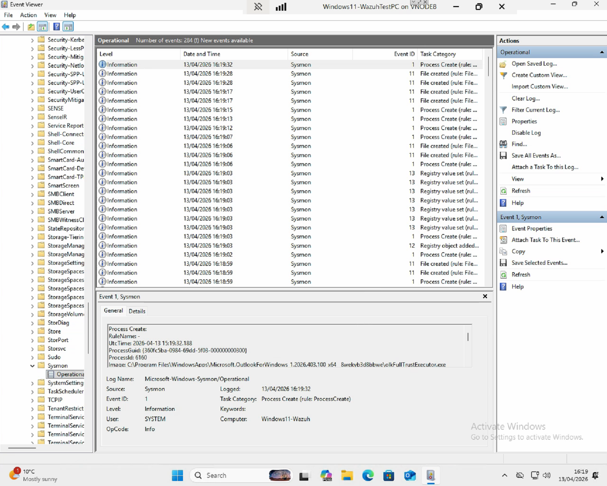

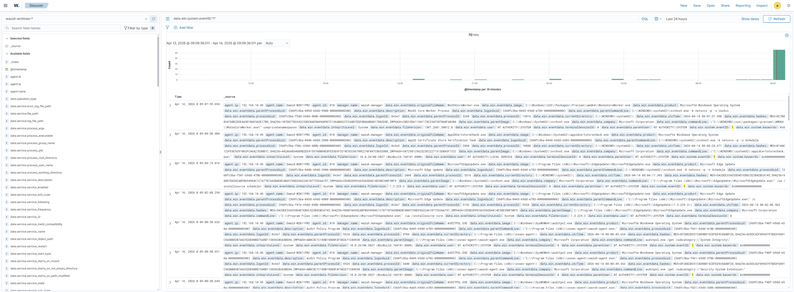

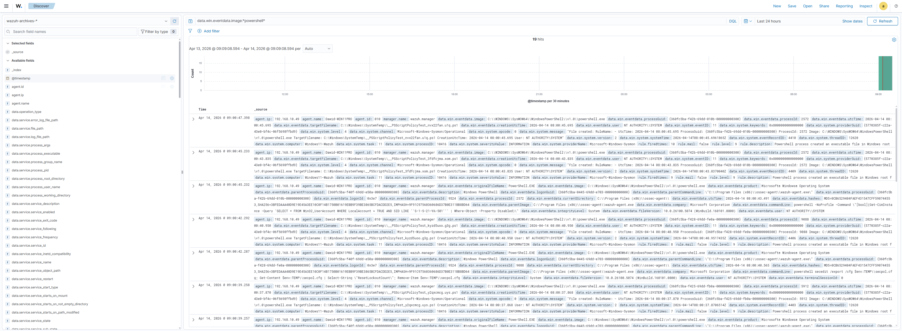

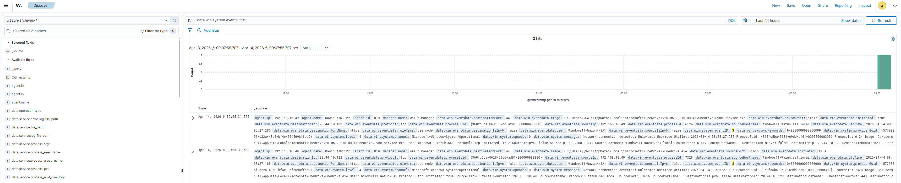

### 2. Simulated suspicious activity

PowerShell execution and encoded commands were generated on the endpoint to create realistic telemetry.

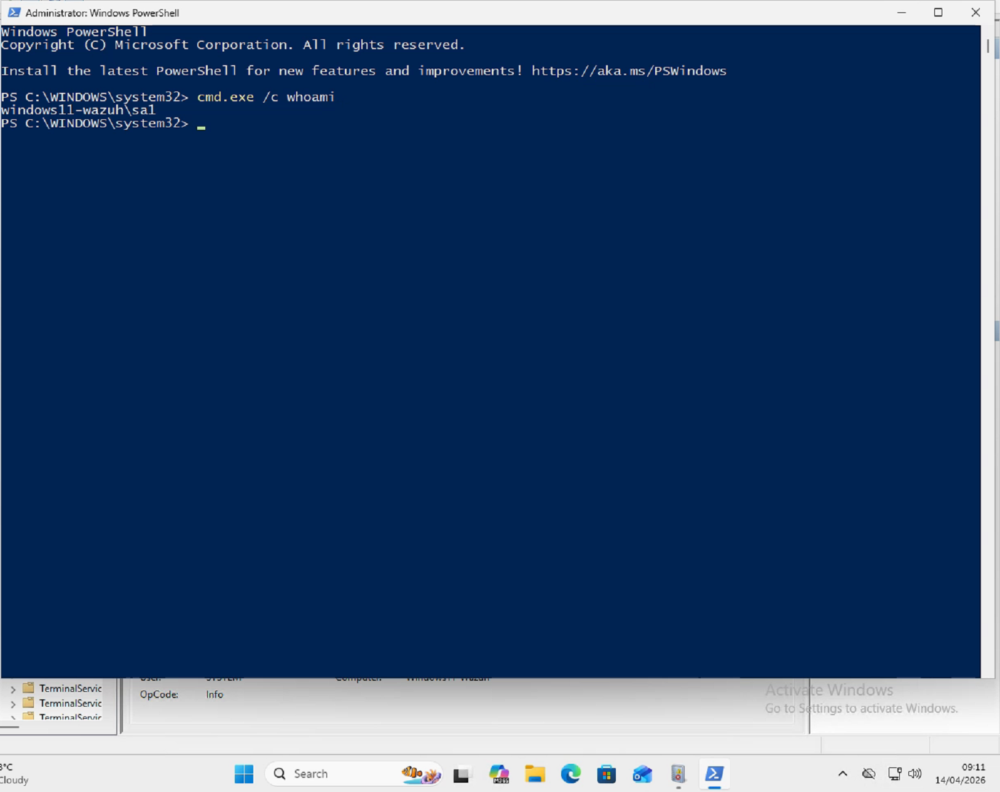

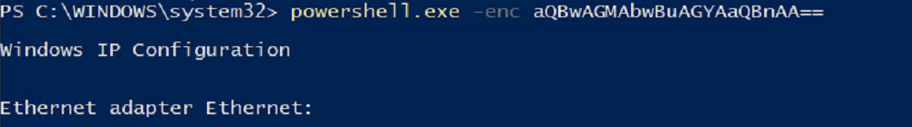

### 3. Wazuh ingestion and visibility

Sysmon logs were forwarded through the Wazuh agent and became searchable in Wazuh.

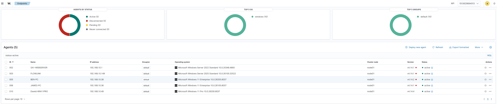

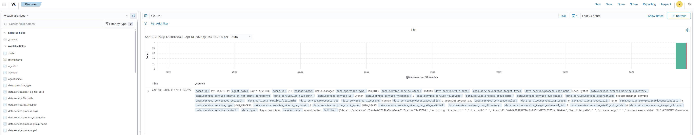

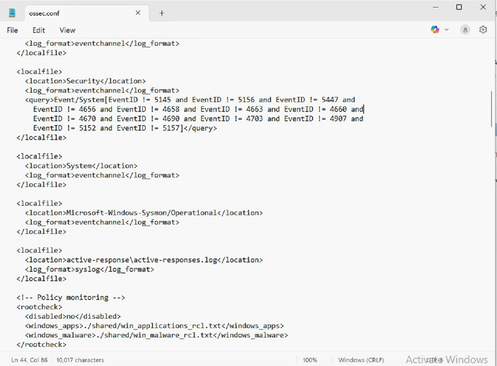

### 4. Rule tuning and validation

Custom rules were added through `local_rules.xml` and tested against real event data.

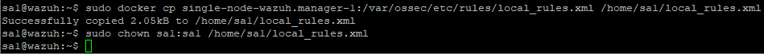

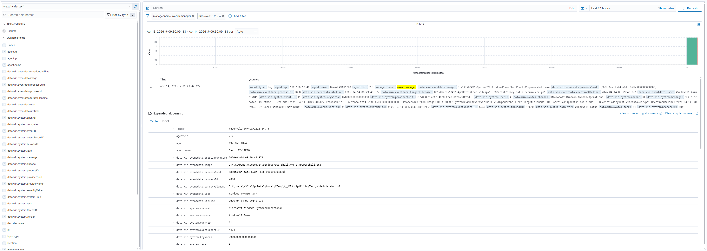

## Detection Results

### Encoded PowerShell Detected
Custom rule `100100` successfully detected encoded PowerShell execution.

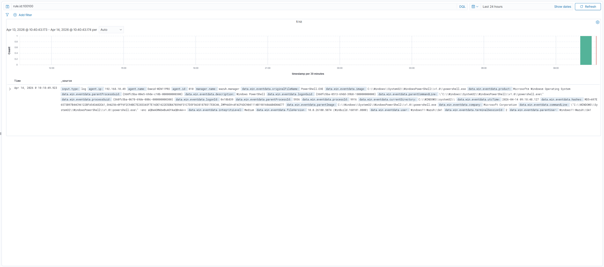

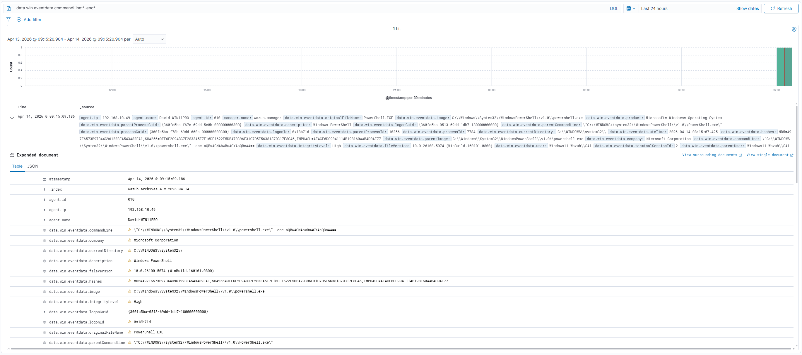

### PowerShell Download Activity Detected
Custom rule `100102` successfully detected PowerShell download behaviour.

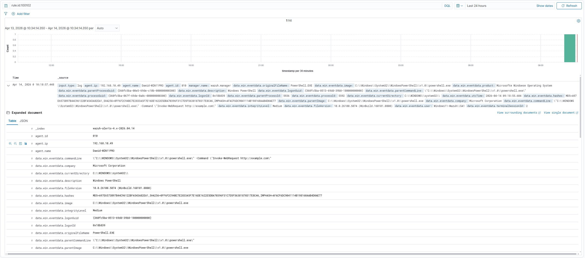

### Built-in PowerShell Execution Detection
Built-in rule `92027` detected PowerShell execution behaviour in live alerts.

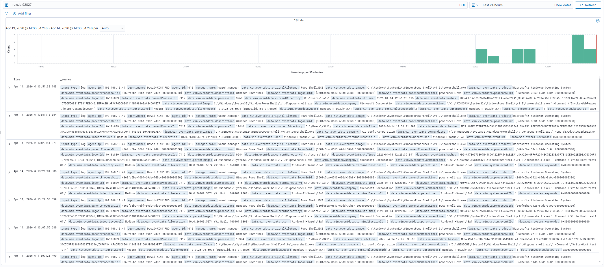

### Built-in CMD to PowerShell Detection
Built-in rule `92032` detected suspicious CMD-based process execution.

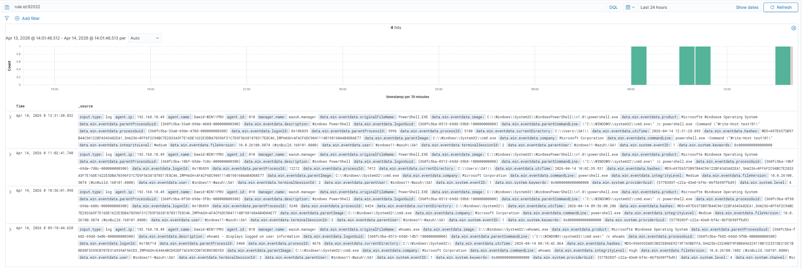

## Additional Event Exploration

During validation I also reviewed additional Sysmon activity to understand how suspicious launches and command execution appeared in the telemetry.

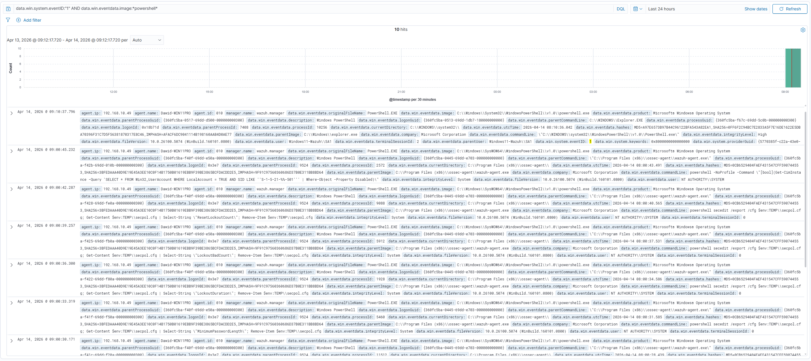

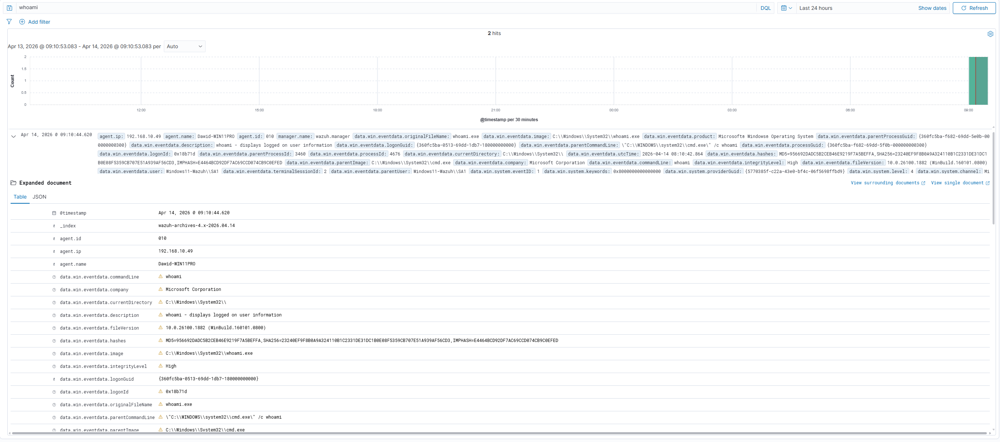

## Dashboard Outcome

The final result was a small SOC-style monitoring view that allowed alert trends and PowerShell-related detections to be reviewed in one place.

This gave the client:

- visibility of suspicious PowerShell execution
- visibility of encoded and download-based activity
- detection confirmation using both custom and built-in Wazuh rules
- a foundation for expanding into broader endpoint detection use cases

## Key Learnings

- Sysmon provides rich Windows telemetry for process creation and command-line visibility
- Wazuh built-in Sysmon rules already cover some generic behaviours well
- Custom rules add value when focused on more specific attacker behaviours like encoded commands and download activity
- Visualizing detections in the dashboard makes alert review much more useful for analysts

## CV Summary

Built a Wazuh-based SIEM lab using Sysmon telemetry to detect and visualize suspicious PowerShell activity on a Windows endpoint. Implemented and validated custom rules for encoded commands and download behaviour, confirmed built-in detections for PowerShell execution and CMD spawning, and created dashboard views to support analyst monitoring.

## MITRE ATT&CK Mapping

| Rule ID | Detection | ATT&CK |
|---|---|---|
| 100100 | Encoded PowerShell | T1059.001 |
| 100102 | PowerShell download activity | T1105 |
| 92027 | PowerShell execution | T1059.001 |
| 92032 | CMD spawning PowerShell | T1059.003, T1087 |

## Repository Structure

```text
.
├── README.md
└── screenshots/
    ├── agent_active_in_wazuh.png
    ├── editing_localrules_to_include_sysmon_rule.png
    ├── implementing_sysmon_events_into_ossec.png
    ├── rule.id_100100_working.png
    ├── rule.id_100102_working.png
    ├── rule.id_92027_working_builtin_powershell_execution.png
    ├── rule.id_92032_cmd_spawning_powershell.png
    ├── sysmon_encoded_command_detected_wazuh.png
    ├── sysmon_eventviewer.png
    ├── sysmon_log_whoami_detected.png
    ├── sysmon_looking_for_suspicious_launches.png
    ├── sysmon_network_connection_log.png
    ├── sysmon_powershell_activity_log.png
    ├── sysmon_process_creation_log.png
    ├── sysmon_rule_appearing_in_wazuhalerts.png
    ├── sysmon_triggering_encoded_powershell.png
    ├── sysmon_visible_in_wazuh.png
    └── triggering_sysmon_log_powershell.png
